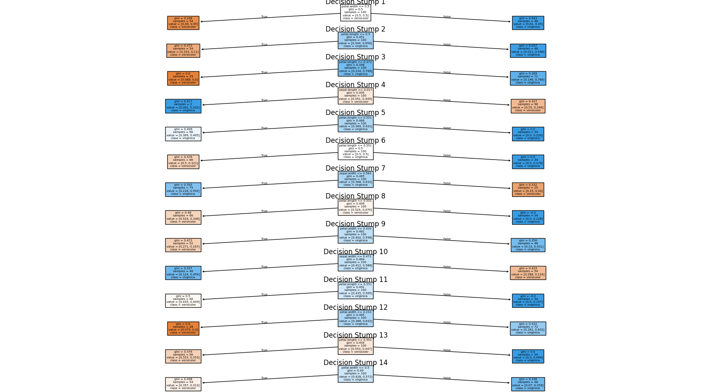

# DT_Test

Workspace for new project focused on Decision Tree modeling

Testing the Fisher Iris dataset with AdaBoost with 14 decision stumps for 100% accuracy using no Cross Validation.

## License

This project is licensed for use both commercially and non-commercially under the MIT License. See the LICENSE file for details.
